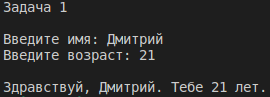

# Задача 1

Напишите программу, которая спрашивает у пользователя имя и сколько ему лет, и выводит на экран сообщение: 

"Здравствуй, [*Имя пользователя*]. Тебе [*Количество лет*] лет!". 

Вместо [*Имя пользователя*] и [*Количество лет*] выведите соответствуюшие введенные пользователем данные. 

Предусматрите вариант, когда пользователь не вводит данных. 

## Результат

